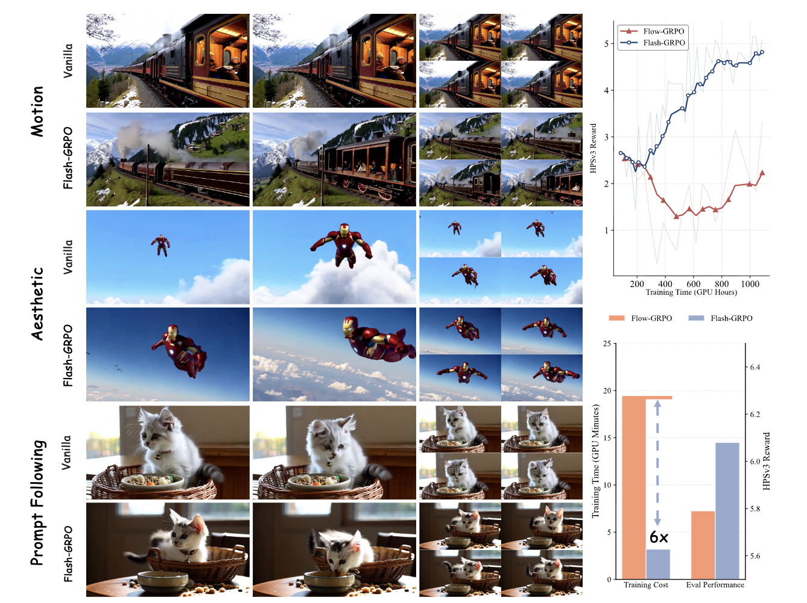
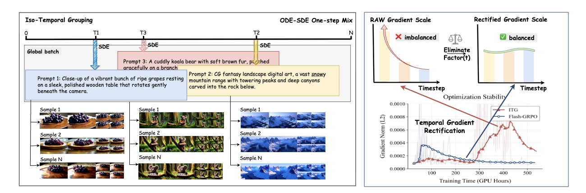

<div align="center" style="font-family: charter;">

<h1>🦕 Flash-GRPO: Efficient Alignment for Video Diffusion via One-Step Policy Optimization</h1>


<a href="" target="_blank">
    </a>
<a href="https://shredded-pork.github.io/Flash-GRPO.github.io/" target="_blank">
    </a>
</div>

**Flash-GRPO**, a single-step training framework that outperforms full trajectory training in alignment quality under low computational budgets while substantially improving training efficiency.

<div style="text-align: center;">
    
</div>

<div style="text-align: center;">
    
</div>

## 🗺️ Roadmap for Flash-GRPO
> Flash-GRPO, a single-step training framework that outperforms full trajectory trainingin alignment quality under low computational budgets while substantially improving training efficiency. Flash-GRPO addresses two critical challenges: iso-temporal grouping eliminates timestep-confounded variance by enforcing prompt-wise temporal consistency, decoupling policy performance
from timestep difficulty; temporal gradient rectification neutralizes the time-dependent scaling factor that causes vastly inconsistent gradient magnitudes across timesteps. Experiments on 1.3B to 14B parameter models validate Flash-GRPO’s effectiveness, demonstrating substantial training acceleration with consistent stability and state-of-the-art alignment qualit
> 
> Welcome Ideas and Contributions. Stay tuned!

## 🆕 News

> We have presented a single-step training framework, **Flash-GRPO**.
- **[2026-05-11]**  We will release the code of our paper, and we alse release a 8 gpus version of Flash-GRPO (can achieve the same performance). 🔥🔥🔥


## 📕 Training & Evaluation
### Preparation
Download the reward model [HPSV3](https://github.com/MizzenAI/HPSv3) and base model [Wan2.1-1.3B](https://huggingface.co/Wan-AI/Wan2.1-T2V-1.3B-Diffusers).

### Training
#### Reward server
```bash
cd flow_grpo/reward-server
gunicorn "app_hpsv3:create_app()" 
```
#### Wan2.1-1.3B
```bash
# Flash-GRPO 96GPUs
bash scripts/multi_node/train_wan2_1_flash.sh
```
#### Wan2.1-1.3B-1node
```bash
# Flash-GRPO 8GPUs
bash scripts/multi_node/train_wan2_1_flash_1node.sh
```

## 📊 Experimental Performance


## 📺 Visualization
 

- For more details please read our paper.

# Acknowledgements
[Flow-GRPO](https://github.com/yifan123/flow_grpo): The first method integrating online reinforcement learning (RL) into flow matching models.
